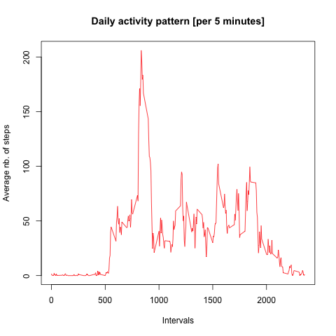

## Loading and preprocessing the data

```{r, echo=TRUE}
#    Read data
unzip ("activity.zip")
activity <- read.csv("activity.csv")
#    Convert Year string to Date value
activity$date <- as.Date(activity$date)
#    Create figure folder
if (!file.exists("figure")) {
     dir.create("figure")
}
```

## What is mean total number of steps taken per day?

```{r, echo=TRUE}
#    Add steps by day
library(dplyr)
stepsperday <- group_by(activity, date)
stepsperday <- summarise(stepsperday, sum(steps, na.rm = TRUE))
stepsperday <- rename(stepsperday, Total.steps = `sum(steps, na.rm = TRUE)`)
#    Plot histogram of steps per day
plot(stepsperday$date, stepsperday$Total.steps, type = "h", lwd = 8, 
     col = "Blue", main = "Total steps per day", xlab = "Date", ylab = "Number of steps")#
dev.copy(png, file="figure/plot1.png")
dev.off()
```


Mean and median total number of steps taken per day:
```{r, echo=TRUE}
#    Report the mean and median total number of steps taken per day
summary(stepsperday$Total.steps)
```

```
##    Min. 1st Qu.  Median    Mean 3rd Qu.    Max. 
##       0    6778   10400    9354   12810   21190
```

## What is the average daily activity pattern?

```{r, echo=TRUE}
#    Calculate average number of steps per interval
stepsperinterval <- group_by(activity, interval)
stepsperinterval <- summarise(stepsperinterval, mean(steps, na.rm = TRUE))
stepsperinterval <- rename(stepsperinterval, Average.steps = `mean(steps, na.rm = TRUE)`)
#    Plot graph
plot(stepsperinterval$interval, stepsperinterval$Average.steps, type = "l", 
     main = "Daily activity pattern [per 5 minutes]", col = "Red", 
     xlab = "Intervals", ylab = "Average nb. of steps")
dev.copy(png, file="figure/plot2.png")
dev.off()
```


Which 5-minute interval, on average across all the days in the dataset, contains the maximum number of steps?
```{r, echo=TRUE}
#    Interval with maximun number of steps
maxsteps <- max(stepsperinterval$Average.steps)
maxinterval <- stepsperinterval$interval[stepsperinterval$Average.steps == maxsteps]
message("Interval ", maxinterval, " contains the highest number of average steps in the day")
```

```
## Interval 835 contains the highest number of average steps in the day
```

## Inputing missing values

```{r, echo=TRUE}
#    Amount is missing data
message("The number of observations without steps available is ", sum(is.na(activity$steps)))
```

```
## The number of observations without steps available is 2304
```

The strategy demonstrated is were NA are replaced by the mean number of steps for that interval.

```{r, echo=TRUE}
#    Replace NA's with mean for that interval
activity.replaced.na <- activity
for (i in seq_along(activity.replaced.na$steps)) {
     if (is.na(activity.replaced.na$steps[i])) {
          activity.replaced.na$steps[i] <- stepsperinterval$Average.steps[stepsperinterval$interval == activity.replaced.na$interval[i]]
     }
}
#    Sum steps by day (NA's replaced)
stepsperday <- group_by(activity.replaced.na, date)
stepsperday <- summarise(stepsperday, sum(steps))
stepsperday <- rename(stepsperday, Total.steps = `sum(steps)`)
#    Plot histogram of steps per day (NA's replaced)
plot(stepsperday$date, stepsperday$Total.steps, type = "h", lwd = 8, 
     col = "Blue", main = "Total steps per day (NA's replaced)", xlab = "Date", ylab = "Number of steps")#
dev.copy(png, file="figure/plot3.png")
dev.off()
```


Mean and median total number of steps taken per day (NA replaced):
```{r, echo=TRUE}
#    Report the mean and median total number of steps taken per day
summary(stepsperday$Total.steps)
```

```
##    Min. 1st Qu.  Median    Mean 3rd Qu.    Max. 
##      41    9819   10770   10770   12810   21190
```

You see in the histogram that intervals without steps have been increased to the mean value, with the effect that the total steps for these days have increased. You see less days with none or minimal steps. Consequently also the Median and Mean have increased.

## Are there differences in activity patterns between weekdays and weekends?

```{r, echo=TRUE}
#    Define the days and its type (weekday or weekend)
library(lubridate)
activity.replaced.na$weekday <- weekdays(activity.replaced.na$date, abbreviate = FALSE)
for (i in seq_along(activity.replaced.na$weekday)) {
     if (activity.replaced.na$weekday[i] == "Saturday" | activity.replaced.na$weekday[i] == "Sunday") {
          activity.replaced.na$daytype[i] <- "Weekend"
     } else {
          activity.replaced.na$daytype[i] <- "Weekday"
     }
}
#
#    Split dataset per day type
weekdays <- filter(activity.replaced.na, daytype == "Weekday")
weekend  <- filter(activity.replaced.na, daytype == "Weekend")
#    take the average steps for each dataset
weekdays <- group_by(weekdays, interval)
weekdays <- summarise(weekdays, mean(steps))
weekdays <- rename(weekdays, Average.steps = `mean(steps)`)
weekend <- group_by(weekend, interval)
weekend <- summarise(weekend, mean(steps))
weekend <- rename(weekend, Average.steps = `mean(steps)`)
#    Merge them together agains for the plot
weekend$daytype <- "Weekend"
weekdays$daytype <- "Weekday"
meanstepsperinterval <- rbind(weekend, weekdays)
#    plot the panel plot
library(ggplot2)
ggplot(meanstepsperinterval, aes(interval, Average.steps)) + 
     facet_grid(daytype ~ .) + geom_line(color = "Red") + 
     theme(text = element_text(size = 15)) + 
     ggtitle("Activity pattern weekend vs. weekday")
dev.copy(png, file="figure/plot4.png")
dev.off()
```

